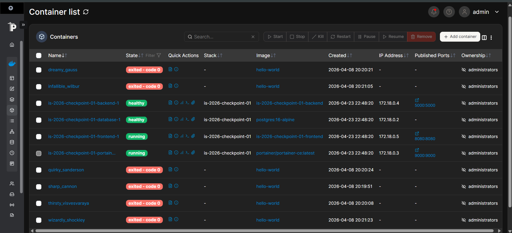
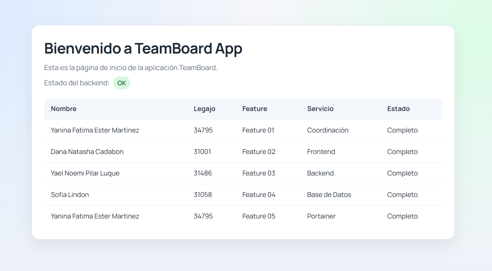

# TeamBoard App - IS-2026 Checkpoint 01
Aplicación web que muestra los integrantes del equipo y la feature que implementó cada uno.

## Integrantes

| Nombre | Legajo |
|--------|--------|
| Yanina Fátima Ester Martinez | 34795 |
| Dana Natasha Cadabon | 31001 |
| Sofia Lindon | 31058 |
| Yael Noemi Pilar Luque | 31486 |

## Features

| Feature | Responsable | Servicio |
|--------|------------|----------|
| F01 - Coordinación | Yanina Fátima Ester Martinez | compose |
| F02 - Frontend | Dana Natasha Cadabon | frontend |
| F03 - Backend | Sofia Lindon | backend |
| F04 - Database | Yael Noemi Pilar Luque | database |
| F05 - Portainer | Yanina Fátima Ester Martinez | portainer |

## Servicios

- **Frontend** — Página HTML en `localhost:8080`. Muestra la tabla de integrantes pedidos al backend.

- **Backend** — API REST desarrollada con Flask en `localhost:5000`. Endpoints: 
    - `/api/health` - indica que el servicio está activo (usado por el HEALTHCHECK de Docker),
    - `/api/team` - devuelve la lista de integrantes leyéndolos desde PostgreSQL
    -  `/api/info` - devuelve metadata del servicio

- **Database** — PostgreSQL 16 sin puerto público. Almacena los datos del equipo en la tabla `members`.

- **Portainer** — Panel de monitoreo Docker en `localhost:9000`. Permite ver el estado de todos los contenedores, los logs de cada servicio y monitorear el uso de CPU y memoria, sin necesidad de usar la terminal.

## Instalación y uso

1. Clonar el repositorio:
```bash
   git clone https://github.com/yamartinez03/is-2026-checkpoint-01.git
   cd is-2026-checkpoint-01
```

2. Copiar el archivo de variables de entorno y completar los valores:
```bash
   cp .env.example .env
```

3. Levantar los servicios:
```bash
   docker compose up --build
```

4. Verificar que todos los servicios estén corriendo:
```bash
   docker compose ps
```
   ó abrir Portainer en `http://localhost:9000` → **local → Containers** para verlos visualmente.

## Acceso

| Servicio | URL |
|----------|-----|
| Frontend | http://localhost:8080 |
| Backend | http://localhost:5000/api/team |
| Portainer | http://localhost:9000 |

## Capturas de Portainer

### Portainer — contenedores corriendo

*Panel de monitoreo mostrando los 4 servicios activos del proyecto.*

### Frontend — TeamBoard App
  
*Página principal con la tabla de integrantes cargada desde la base de datos.*